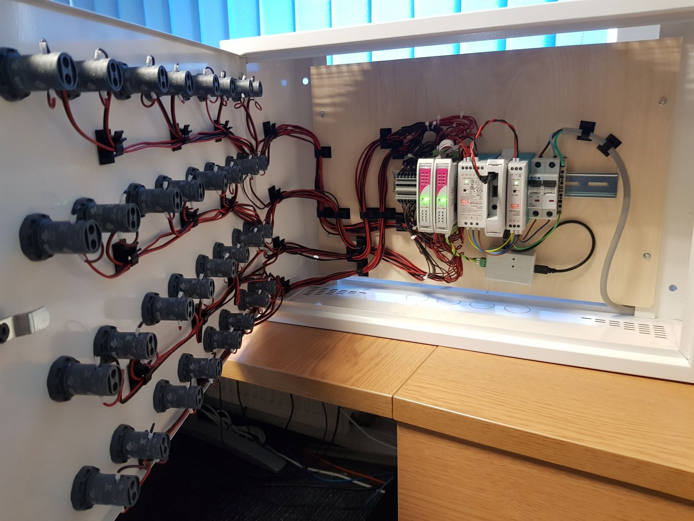

# Stability box

## Purpose of the box

The purpose of the box is reading test statuses from the JIRA (Xray plugin) and appropriate control of the LED diodes on the box. When we have a lot of test result it is easy to miss some important information. But that box will be hold the state if something is wrong on the stability tests until the user confirms it. 

## Construction

The box consist of 16 green LEDs and 16 red LEDs. So there is a possibility to verify 16 different stability stations. Every station have two LEDs: green - when everything is ok, red - when something went wrong. 

In the inside we can find the following elements:
- **overcurrent switch** - to turn on/off the power
- **24V DC power supply** - for SFAR devices
- **5V DC power supply** - for RPI
- **RPI** - used to run the box 24/7
- **SFAR devices** - used to LEDs control
- **USB/RS485 converter** - for communication between RPI and SFAR devices

## How it works

Code is working in the endless loop. In every 30 minutes reads the states of the test plans (test plans run every hour). If every test plan is PASSED, the green light in the specific station will be turn on. If at least one test will be FAILED, the red light in the specific station will be turn on until the user confirms it on the website. 

The website is provided by RPI on the server, where every user has access. 

The HTML file is generate in every 30 minutes, and also when user confirms the alarm. 

## LED diodes test

## Adding new stability station

There is a few steps:
1. Add new station name in any empty station in file: *stability_control/stability_data_base/stability_config.json*
2. Create a file with the same name in .json format in the folder: *stability_control/stability_data_base/stations/*
3. From *stability_template.json* copy the content and paste it to the new file. FIll the name and list of test plans accordingly.

## Confirming alarms
RPI provides a simple website that looks like this:

When something is wrong with the stability, the RPI will generate a button for specific station:

If we know the cause of the error we can confirm it, clicking the button next to specific station.

## In the future
- add logger
- add authorization for confirming alarms
